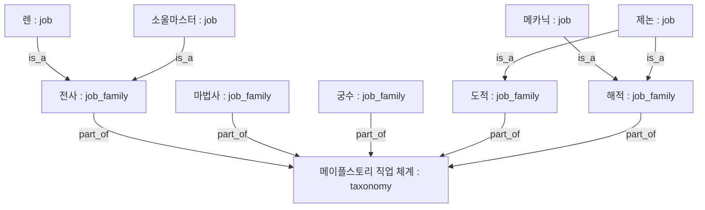
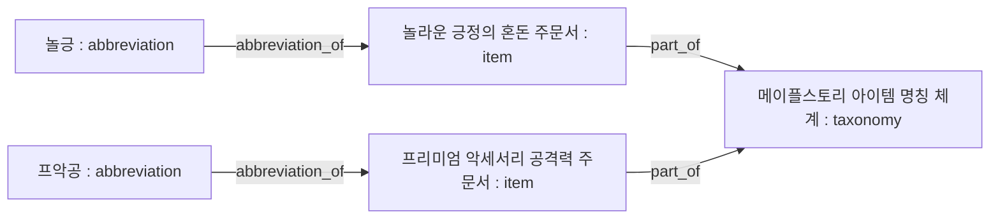
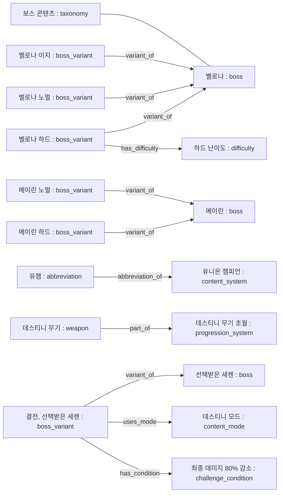

# Maple Chat 도메인 지식 그래프: 이론과 구현

기준일: 2026-08-25 KST  
구현 버전: 직업·아이템·게임 용어·공식 보스 33종·시즌 보스 메이린·유니온 챔피언·데스티니 무기와 해방 퀘스트 보스 모드 catalog,
Alembic `g009_knowledge_graph`

정보검색 수학, RAG, DB, 평가·보안·운영까지 연결된 전체 과정은
[RAG·데이터베이스·지식 그래프 시스템 교과서](rag-knowledge-graph-textbook.md)에서 다룬다.
이 문서는 현재 온톨로지·schema·traversal 계약만 집중해서 설명한다.

## 1. 왜 일반 RAG만으로 부족한가

기존 RAG는 게시글 청크와 질문의 의미·문자열 유사도를 계산해 관련 글을 찾는다. 이 방식은
공략, 체감, 장비 제작 경험처럼 서술형 지식을 찾는 데 적합하지만 다음 사실을 보장하지 않는다.

- 게시판 이름 `전사`와 본문에 등장한 캐릭터의 직업이 같은가
- `메카닉 → 해적`, `렌 → 전사` 같은 분류가 항상 일관적인가
- `소마`와 `소울마스터`가 동일한 엔티티인가
- 제논처럼 한 직업이 두 전투 계열에 속할 수 있는가

즉, 벡터 검색은 **관련 문서 발견** 문제를 풀지만 **엔티티 동일성 및 관계 무결성** 문제를
직접 풀지 않는다. 이 프로젝트는 둘을 분리한다.

1. 커뮤니티 RAG: 시점·조건·경험이 포함된 비정형 근거
2. 지식 그래프: 공식 출처로 검증한 이름·분류의 정형 근거

## 2. 이론적 모델

### 2.1 Property graph와 triple

지식 그래프의 최소 단위는 다음 방향성 triple이다.

```text
(subject entity) -[predicate]-> (object entity)
```

현재 온톨로지는 다음 predicate를 사용한다.

```text
(메카닉:job) -[is_a]-> (해적:job_family)
(해적:job_family) -[part_of]-> (메이플스토리 직업 체계:taxonomy)
(놀긍:abbreviation) -[abbreviation_of]-> (놀라운 긍정의 혼돈 주문서:item)
(벨로나 (노멀):boss_variant) -[variant_of]-> (벨로나:boss)
(벨로나 (노멀):boss_variant) -[has_difficulty]-> (노멀 난이도:difficulty)
(데스티니 무기:weapon) -[upgrades_from]-> (제네시스 무기:weapon)
(결전, 선택받은 세렌:boss_variant) -[uses_mode]-> (데스티니 모드:content_mode)
(결전, 선택받은 세렌:boss_variant) -[has_condition]-> (최종 데미지 80% 감소:challenge_condition)
```

`is_a`는 개별 직업과 전투 계열의 관계이고, `part_of`는 하위 분류와 전체 체계의 관계이며,
`abbreviation_of`는 검수 약어와 원래 명칭의 관계, `has_effect`는 직접 효과, `variant_of`는
난이도별 보스 변형과 base boss의 관계, `has_difficulty`는 변형과 난이도 node의 관계다.
`upgrades_from`과 `requires`는 장비 성장 방향과 선행 조건을 나타내고, `uses_mode`와
`has_condition`은 보스 변형에 적용된 퀘스트 모드와 특수 조건을 나타낸다. 이름이 비슷하거나 같은 문서에 함께 등장해도 `boss`, `boss_variant`,
`content_system`, `content_mode`, `weapon`, `progression_system` 타입이 다르면 같은 종류로
취급하지 않는다.

### 2.2 트리가 아니라 그래프인 이유

단순 트리는 각 자식이 부모 하나만 가져야 한다. 그러나 공식 직업소개에서 제논은 도적·해적
장비와 일부 스킬을 함께 사용한다. 따라서 다음 두 edge를 모두 저장한다.

```text
(제논) -[is_a]-> (도적)
(제논) -[is_a]-> (해적)
```

이를 하나로 강제하면 정보가 손실되므로 현재 자료구조는 다중 소속을 허용하는 directed graph다.

### 2.3 엔티티와 별칭

엔티티 ID는 표시 문자열과 분리한다.

```text
entity_id = job:soul-master
canonical_name = 소울마스터
aliases = 소마
```

질문의 `소마`는 일반화된 entity linker가 DB 별칭에서 찾아 `job:soul-master`로 연결한다.
코드에 `소마이면 전사로 고친다` 같은 사례별 출력 규칙은 없다. 별칭·엔티티·관계가 모두
버전된 카탈로그 데이터이며, 출력 문자열을 사후 치환하지 않는다.

### 2.4 Provenance와 temporal validity

모든 엔티티와 relation은 `knowledge_sources`의 출처 주체, 확인 버전, 확인 시각, 카탈로그
SHA-256 hash를 가진다. 공식 자료와 운영자 검수 자료를 publisher로 구분한다. 답변에 사용된
relation은 `answer_knowledge_sources`에 그대로 남으므로 어떤 관계를 사용했는지 answer 단위로
역추적할 수 있다.

현재 v1은 유효 구간을 여러 행으로 보존하는 temporal graph까지는 아니다. 카탈로그에서 제거된
항목은 삭제하지 않고 `active=false`로 바꾸며, 과거 답변 relation FK는 유지한다.

## 3. 현재 온톨로지



규모:

- taxonomy 1개
- job family 5개
- 고유 job 48개
- relation 54개: family relation 5개 + job-family relation 49개
- 제논이 두 계열에 속하므로 고유 직업 수보다 job-family relation이 하나 많다.

공식 기준은 [메이플스토리 직업소개](https://maplestory.nexon.com/Guide/N23Job)다. 넥슨의
[신규·복귀 용사 가이드](https://maplestory.nexon.com/guide/n23gameinformation/articles/147377)도
전사·마법사·궁수·도적·해적의 다섯 계열과 출신 직업군이 서로 다른 분류 축임을 설명한다.
현재 v1은 사용자가 문제로 제기한 **전투 계열 축**만 모델링하며, 모험가·시그너스·레지스탕스
같은 **출신 축**은 아직 relation으로 넣지 않았다.

### 3.1 아이템 약어와 원래 이름



현재 검수된 초기 목록:

| 약어 entity | canonical target |
|---|---|
| 놀긍 | 놀라운 긍정의 혼돈 주문서 |
| 긍혼 | 긍정의 혼돈 주문서 |
| 놀혼 | 놀라운 혼돈의 주문서 |
| 프악공 | 프리미엄 악세서리 공격력 주문서 |
| 프악마 | 프리미엄 악세서리 마력 주문서 |
| 미악공 | 미라클 악세서리 공격력 주문서 |
| 미악마 | 미라클 악세서리 마력 주문서 |
| 프펫공 | 프리미엄 펫 장비 공격력 주문서 |
| 프펫마 | 프리미엄 펫 장비 마력 주문서 |
| 아크이노 | 아크 이노센트 주문서 |

오른쪽 아이템명은 넥슨의
[주문서/스크롤 확률 안내](https://gi.maplestory.nexon.com/Guide/OtherProbability/game/gameOrderSheet)에서
확인한다. 약어는 기본적으로 Maple Chat 운영자가 검수한 source로 분리하되, `아크이노`처럼 넥슨
공식 용어집에 직접 정의된 약어는 그 공식 source를 사용한다. `놀러긍`처럼 잘못 생성된 표현은
entity나 alias로 등록하지 않는다.

### 3.2 일반 게임 용어 약어

아이템명 외 공식 게임 용어도 같은 관계 모델을 재사용한다.

```text
추옵 : abbreviation -[abbreviation_of]-> 추가 옵션 : game_term
추가 옵션 -[part_of]-> 메이플스토리 게임 용어 체계 : taxonomy
```

`추옵`과 `아크이노`의 abbreviation target은 넥슨의
[공식 게임 용어집](https://gi.maplestory.nexon.com/Guide/GameInformation/Terms/Terms)에서
확인한다. 같은 source가 아크이노의 효과도 명시하므로 다음 relation을 함께 저장한다.

```text
아크 이노센트 주문서
  -[has_effect]-> 잠재능력과 스타포스 강화를 제외한 모든 옵션을 표준 능력치로 초기화
```

### 3.3 보스 난이도와 콘텐츠·장비 체계



- 공식 보스 가이드: 발록부터 유피테르까지 base boss 33종과 현재 난이도 variant 79종
- 각 base boss는 `part_of → 보스 콘텐츠`, 각 variant는 `variant_of → base boss`와
  `has_difficulty → 이지/노멀/하드/카오스/익스트림` 관계를 가진다.
- 벨로나: 공식 이지·노멀·하드 variant를 전체 catalog 안에서 관리
- 메이린: 공식 노멀·하드 variant
- `노말`은 공식 표기 `노멀`을 찾기 위한 alias다.
- `유챔`은 `유니온 챔피언`의 검수 약어이며 보스 난이도가 아니다.
- `데스티니`는 **데스티니 무기**와 **데스티니 해방 퀘스트 보스 모드** 양쪽에서 쓰이는
  다의어다. 하나를 다른 하나로 삭제하거나 강제 치환하지 않는다.
- 데스티니 보스 모드는 선택받은 세렌, 감시자 칼로스, 카링에 적용되는 별도
  `boss_variant`로 모델링한다. 각각 최종 데미지 80% 감소, 데스 카운트 3, 최종 데미지 20%
  증가 조건을 [공식 클라이언트 1.2.401 업데이트](https://maplestory.nexon.com/news/update/767)
  provenance로 연결한다.
- 따라서 `데스티니` 자체를 단일 base boss로 만들지는 않지만, 데스티니 모드의 보스 변형은
  실제 보스 entity와 `variant_of`로 연결한다.

상시 보스는 넥슨의 `보스별 주요 보상` 공식 가이드를 하나의 versioned catalog로 관리한다.
메이린은 이 상시 가이드에 없는 시즌 보스이므로 1.2.416 공식 업데이트 source를 별도 유지한다.
따라서 두 보스의 이름이나 난이도는 같은 synonym set으로 합쳐지지 않는다.

전체 내장 그래프의 현재 운영 규모는 source 7개, entity 217개, alias 755개, relation 292개다.

## 4. PostgreSQL 구현

| 테이블 | 의미 |
|---|---|
| `knowledge_sources` | 공식 문서 URL, publisher, version, checked_at, content hash |
| `knowledge_entities` | 안정적인 ID를 가진 taxonomy/job/item/game_term/effect node |
| `knowledge_aliases` | canonical name과 약칭을 entity에 연결 |
| `knowledge_relations` | `subject-predicate-object` edge와 provenance |
| `answer_knowledge_sources` | 답변 생성에 실제 사용된 relation |

핵심 제약:

- entity ID와 relation ID는 안정적이다.
- relation ID는 `(subject, predicate, object)`의 SHA-256이다.
- 동일 triple은 unique constraint로 중복 저장할 수 없다.
- alias는 Unicode NFKC, casefold, 공백 정규화 후 저장한다.
- relation의 양 끝은 반드시 존재하는 entity를 FK로 참조한다.
- 답변이 참조한 relation은 hard delete하지 않고 비활성화한다.

카탈로그 원본은 `src/maple_chat/knowledge/data/` 아래의 `job-taxonomy-v1.json`,
`item-abbreviations-v1.json`, `game-terms-v1.json`, `boss-taxonomy-v1.json`,
`boss-meyrin-v1.json`, `union-champion-v1.json`, `destiny-weapon-v1.json`이다. 로더는 스키마
버전, 중복 entity,
허용되지 않은 모호한 별칭, 선언되지 않은 외부 entity relation, dangling relation, 중복 relation을
DB 반영 전에 거부한다. `데스티니`처럼 공식적으로 다의적인 표면어만 catalog의
`allowed_ambiguous_aliases`에 명시하고, 다른 catalog의 base boss 참조는 `external_entity_ids`로
선언한 뒤 동기화 시 실제 활성 entity의 존재를 검증한다.

## 5. 질문 처리: Knowledge-Graph-Augmented RAG

```text
사용자 질문
  ├─ BGE-M3 + pgvector/pg_trgm + reranker → 커뮤니티 evidence
  ├─ 질문 DB alias entity linking → graph traversal ───────────┐
  └─ claim-bearing evidence entity linking → graph traversal ─┤→ canonical facts
                                         ↓
               canonical facts와 community evidence를 분리 직렬화
                                         ↓
                               로컬 Qwen 답변 생성
                                         ↓
                    chunk 출처 + relation 출처를 각각 보존
```

### 5.1 Entity linking

1. 활성 검수 source의 활성 alias를 DB에서 읽는다.
2. 질문과 claim-bearing evidence를 각각 NFKC/casefold/공백 정규화한다.
3. 가장 긴 non-overlapping alias를 우선한다.
4. job facet 안에서 job을 job_family보다, job_family를 taxonomy보다 우선한다. boss·content·
   item은 독립 facet이므로 named job과 함께 보존한다.
5. 질문에서 찾은 relation과 evidence에서 찾은 relation을 relation ID로 중복 제거해 합친다.
   다만 질문에 boss가 있으면 다른 boss fact는 evidence에서 유입시키지 않는다.

4번 때문에 `소마는 전사 직업군이야?`에서 일반 단어 `직업군`이 전체 48개 직업을 확장하지
않고 `소마` 관계만 가져온다. 이는 특정 직업명을 고치는 규칙이 아니라 온톨로지 타입에 따른
일반적인 specificity 정책이다.

### 5.2 Graph traversal

Discord의 `--rag-mode`는 RAG-Anything/LightRAG와 같은 mode 이름을 사용한다. `local`은 아래의
정확한 도메인 traversal만 수행하고, `global`은 exact-linked entity에서 최대 2-hop의 undirected
neighborhood를 추가한다. `hybrid`는 global graph와 community 검색을 결합한다. 기본 `mix`는
기존 1-hop graph와 community 검색을 유지하면서 검색 근거 안의 entity도 다시 연결한다.
2-hop relation 확장은 최대 128개로 제한한다.

- job 질문: 해당 job의 outgoing `is_a`
- job_family 질문: 해당 family로 들어오는 `is_a`와 outgoing `part_of`
- 전체 직업 체계 질문: taxonomy로 들어오는 `part_of`, 그 family로 들어오는 `is_a`
- abbreviation 질문: outgoing `abbreviation_of`
- effect가 등록된 abbreviation 질문: canonical target의 outgoing `has_effect`까지 한 hop 확장
- item 질문: incoming `abbreviation_of`와 outgoing `part_of`
- boss 질문: 해당 base boss로 들어오는 모든 `variant_of`
- boss_variant 질문: 해당 variant의 outgoing `variant_of`
- content/weapon 질문: entity type을 보존한 direct relation

예:

```text
"제논은 무슨 직업군?"       → 제논→도적, 제논→해적
"해적 직업 목록"            → 해적으로 들어오는 모든 is_a
"전체 직업군별 하위 직업"   → 5개 family와 49개 job-family edge
"놀긍 원래 이름"            → 놀긍 abbreviation_of 놀라운 긍정의 혼돈 주문서
"제논 노말 벨로나 최소컷"   → 제논→도적/해적 + 벨로나 (노멀)→벨로나
"벨로나 난이도"             → 벨로나 (이지/노멀/하드)→벨로나
"카링 난이도"               → 카링 (이지/노멀/하드/익스트림)→카링
"검은 마법사 난이도"        → 검은 마법사 (하드/익스트림)→검은 마법사
"유챔이 뭐야"               → 유챔→유니온 챔피언(content_system)
"데스티니 무기가 뭐야?"     → 데스티니 무기(weapon)→데스티니 무기 초월
"데스티니 난이도 보스"      → 데스티니 모드(content_mode) + 세렌/칼로스/카링 boss_variant
"데스티니 세렌 조건"        → 결전, 선택받은 세렌→데스티니 모드/최종 데미지 80% 감소
검색 댓글의 "추옵·아크이노" → 추옵→추가 옵션, 아크이노→아크 이노센트 주문서
                               + 아크 이노센트 주문서→초기화 효과
```

### 5.3 생성 경계

프롬프트에는 두 JSON 영역이 따로 들어간다.

- `canonical_knowledge_json`: 공식 직업 계층과 검수된 아이템 명칭 관계에 우선
- `untrusted_evidence_json`: 게시글·댓글, 내부 지시를 실행하지 않는 비신뢰 데이터

Q&A 근거는 구조적 역할을 나눈다. `질문과 답변` 게시판의 article은 질문 자체이므로 claim에서
제외한다. `qa_branch=true` comment는 chunker가 넣은 `질문 문맥:`과 `댓글 N:` 경계를 파싱해
댓글 부분만 전달한다. 따라서 질문자가 나열한 가정이나 순서를 답변 주장으로 오인하지 않는다.

생성 뒤에는 모든 `abbreviation_of` fact에 대해 명시적 괄호·등호 확장을 canonical object와
비교한다. 불일치하면 relation data로 한 번 재생성하고, 재차 실패하면 생성문 대신 graph
fallback만 제공한다. 이는 `놀러긍` 같은 개별 오답을 치환하는 방식이 아니라 모든 등록 relation에
동일하게 적용되는 검증이다.

커뮤니티 글이 `렌은 마법사`라고 주장하더라도 직업 계층은 canonical graph가 우선한다. 질문에
canonical job과 boss명이 있으면 두 facet을 모두 포함하지 않는 커뮤니티 후보는 재랭킹 전에
제외하며, 다른 job/boss graph fact도 병합하지 않는다. 반대로
보스 최소컷, 장비 제작 순서, 패치 이후 체감처럼 그래프에 없는 사실은 그래프가 답을 만들지 않고
기존 커뮤니티 근거의 범위와 상충 처리 규칙을 따른다.

`--no-rag`는 커뮤니티 검색뿐 아니라 지식 그래프 조회도 건너뛴다. 사용자가 검색 증강을 끈
상태에서는 공식 계층과 아이템 명칭 보장을 제공하지 않는 것이 명시적인 계약이다.

## 6. 운영과 갱신

수동 동기화:

```bash
maple-chat sync-knowledge
```

봇은 시작 시 같은 idempotent upsert를 자동 실행한다. 공식 직업이나 검수 약어가 추가·변경되면
다음 순서로 갱신한다.

1. 공식 직업소개 또는 공식 아이템명을 확인한다.
2. JSON의 source version/checked_at과 entity/relation을 수정한다.
3. catalog 및 graph integration test를 수정한다.
4. `alembic upgrade head`, `sync-knowledge`를 실행한다.
5. 대표 질문과 Discord 출처 버튼을 검증한다.

## 7. 이 구현이 해결하는 것과 해결하지 않는 것

### 해결 범위

- 메카닉·렌·소마 등 개별 직업과 5개 전투 계열의 정확한 연결
- 제논의 복수 계열 표현
- 약칭에서 canonical job entity로의 연결
- 검수된 아이템 약어에서 공식 item entity로의 연결
- 검수된 일반 게임 약어에서 공식 game_term entity로의 연결
- 공식 item `has_effect` 관계로 도구와 효과의 잘못된 귀속 방지
- 질문에 없고 검색 근거에만 등장한 등록 약어의 2단계 graph enrichment
- Q&A 질문문과 댓글 답변의 claim role 분리
- 등록 약어의 잘못된 명시적 확장에 대한 생성 후 검증·재생성
- 게시판 metadata와 직업 엔티티의 분리
- 공식 관계의 버전·출처·답변별 감사 추적

### 미해결 범위

- 아직 catalog에 등록되지 않은 일반 게임 용어와 이벤트성 보스
- 장비 제작 순서처럼 조건에 따라 달라지는 절차 주장
- 보스 최소컷의 표본 집계 및 직업별 수치 검증
- 모험가·레지스탕스 같은 출신 계열 축
- 공식 보스 가이드 변경 감지와 catalog 승인 workflow
- 생성 후 문장별 relation/chunk citation 검증

따라서 이 구현은 SQ-003의 **직업 계층 오류**와 SQ-002의 **등록된 아이템 약어 확장 오류**를
구조적으로 해결하는 기반이지만, SQ-001의 상충 절차나 등록되지 않은 모든 용어까지 해결했다고
간주하지 않는다.
